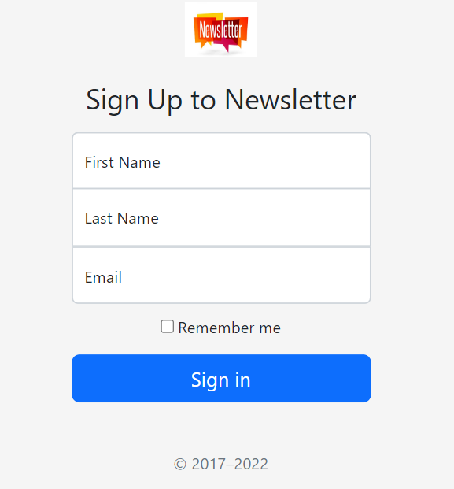

---

# Newsletter Signup Project

## Project Overview

This project is a simple newsletter signup application built using Node.js and Express. It allows users to enter their first name, last name, and email address to subscribe to a newsletter. Upon submission, the app integrates with Mailchimp to manage the subscriber list. Users will receive feedback through success or failure pages based on the outcome of their signup request.



## Features

- **User Signup**: Users can enter their details to subscribe to the newsletter.
- **Feedback Pages**: Users receive confirmation of their subscription status through dedicated success and failure pages.
- **Mailchimp Integration**: The application communicates with the Mailchimp API to handle subscriptions.

## Technologies Used

- **Node.js**: JavaScript runtime for building the server.
- **Express**: Web framework for Node.js to handle HTTP requests.
- **Bootstrap**: Frontend framework for responsive design.
- **Mailchimp API**: For managing newsletter subscriptions.

## Installation Instructions

To get started with this project, follow these steps:

1. **Clone the repository**:

   ```bash
   git clone https://github.com/yourusername/newsletter-signup.git
   cd newsletter-signup
   ```

2. **Install Dependencies**:

   Make sure you have [Node.js](https://nodejs.org/) installed. Then, run the following command to install the required packages:

   ```bash
   npm install
   ```

3. **Set Up Mailchimp**:

   - Create a Mailchimp account if you don't have one.
   - Create an audience list in Mailchimp.
   - Replace the list ID and API key in `app.js` with your own:

   ```javascript
   const url = "https://us21.api.mailchimp.com/3.0/lists/YOUR_LIST_ID";
   const options = {
       method: "POST",
       auth: "YOUR_USERNAME:YOUR_API_KEY"
   }
   ```

4. **Start the Server**:

   You can start the server using:

   ```bash
   node app.js
   ```

   The server will run on `http://localhost:3000`.

5. **Access the Application**:

   Open your web browser and go to `http://localhost:3000` to see the newsletter signup form.

## Usage

1. Fill in your first name, last name, and email address in the form.
2. Click the "Sign Up" button to submit your details.
3. Depending on the response from Mailchimp, you will be redirected to a success or failure page.

## Project Structure

```
newsletter-signup/
│
├── app.js              # Main application file
├── public/             # Folder for static assets (CSS, images)
│   ├── css/            # Custom styles
│   └── Image/          # Images used in the app
│
├── signup.html         # HTML file for the signup form
├── success.html        # HTML file displayed on successful signup
└── failure.html        # HTML file displayed on failed signup
```

## Contributing

If you want to contribute to this project, feel free to fork the repository and submit a pull request. 

## License

This project is licensed under the MIT License. See the LICENSE file for details.

---

